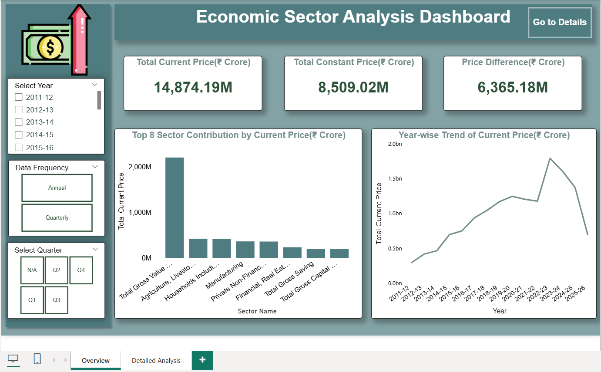
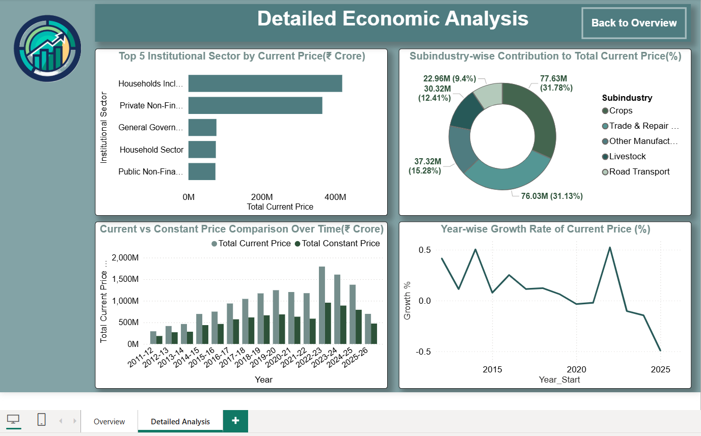

# Economic Sector Analysis Dashboard

## Introduction

This project focuses on analyzing economic sector data using Power BI. The dataset includes indicators such as current prices, constant prices, sector classification, and time-based trends (annual and quarterly).

The goal of this project is to understand:

- Sector-wise economic contribution
- Growth trends over time
- Differences between current and constant prices
- Impact of inflation on economic indicators

The dataset required extensive data cleaning and preprocessing, including handling missing values, managing mixed units (₹ Crore and %), and creating new features such as Sector Name, Year_Start, and Period.

## Data Preparation

Key steps performed:

- Removed duplicate records
- Handled missing values:
- Used Unknown where both fields were empty
- Used N/A where not applicable
- Filtered inconsistent units (₹ Crore vs %)
- Created new columns:
   Sector Name (merged categorical fields)
   Year_Start (for proper sorting)
   Period (Annual / Quarterly)
- Cleaned and formatted data for Power BI analysis

## Dashboard Features

Page 1: Overview Dashboard
KPI Cards:
- Total Current Price
- Total Constant Price
- Price Difference
- Top 8 Sector Contribution (Bar Chart)
- Year-wise Trend (Line Chart)
Interactive slicers:
- Year
- Frequency
- Quarter
Page 2: Detailed Analysis
- Growth % Trend (Line Chart)
- Current vs Constant Price Comparison (Clustered Column Chart)
- Subindustry Distribution (Donut Chart)
- Institutional Sector Contribution(Clustered Bar Chart)

##  Dashboard Preview

### Page 1: Overview Dashboard

### Page 2: Detailed Economic Analysis

## Key Insights

- Total Current Price is higher than Total Constant Price, showing inflation impact over time.
- Economic growth increased steadily from 2011-12 to 2022-23.
- A decline is visible after 2023-24 in current price trends.
- Total Gross Value Added is the highest contributing sector.
- Agriculture and Manufacturing sectors contribute significantly to the economy.
- Current Price remains higher than Constant Price across all years.
- Growth rate fluctuates, showing both economic growth and slowdown periods.
- Crops and Trade & Repair Services are major contributing subindustries.

## Tools Used

- Power BI – Dashboard creation and visualization
- Python (Pandas, Matplotlib, Seaborn) – Data cleaning and EDA
- Excel – Initial data handling

## Conclusion

This project demonstrates how raw economic data can be transformed into meaningful insights through proper data cleaning and visualization techniques.
By comparing current and constant prices, the analysis provides a clear understanding of:

- Sector-wise economic performance
- Inflation effects
- Growth patterns over time

The dashboard enables users to interactively explore the data and gain valuable insights for decision-making and analysis.
